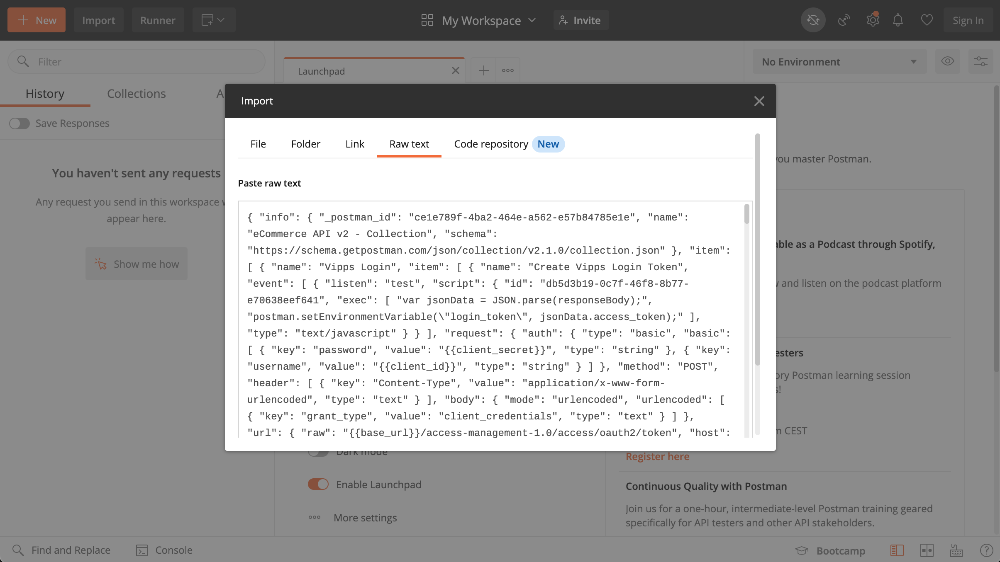
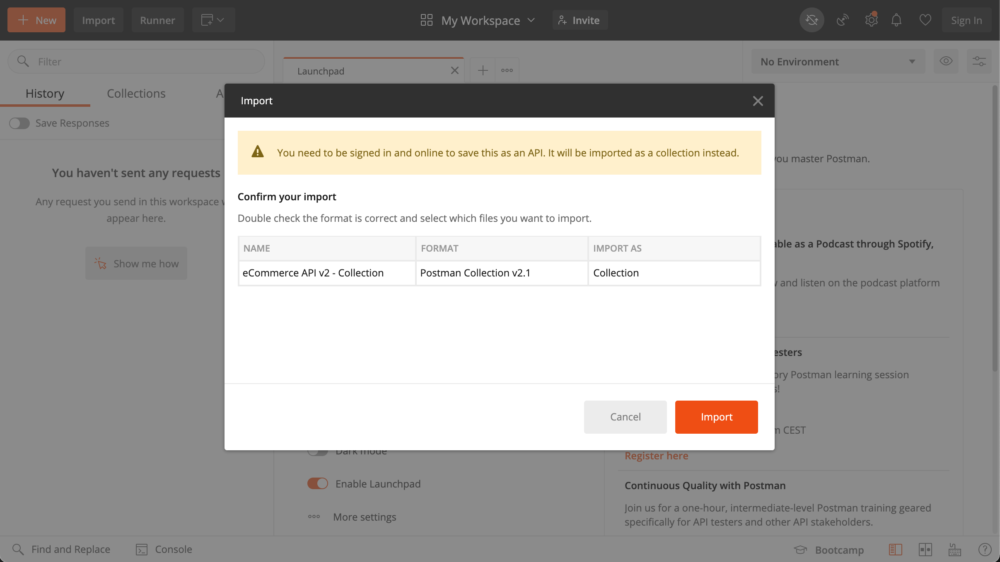

<!-- START_METADATA
---
title: Quick start guides
sidebar_position: 15
---
END_METADATA -->

# Quick start guides

<!-- START_TOC -->

## Table of Contents
* [Postman](#postman)
  * [Import collections and environments](#import-collections-and-environments)
  * [Insert values](#insert-values)
  * [Tabs](#tabs)
* [Quick start guides](#quick-start-guides)
* [Questions?](#questions)

<!-- END_TOC -->

Document version: 4.0.0.

## Postman

[Postman](https://www.getpostman.com/) is a common tool for working with REST APIs.
We offer a [Postman Collection](https://www.getpostman.com/collection) to make development easier.
See the [Postman documentation](https://www.getpostman.com/docs/) for more information about using Postman.

With Postman, you can make calls to all the API endpoints and see the full
request and response for each call, including headers.

We offer Quick start guides for our APIs so you can try them out, and also
to use in development and to trouble-shoot in case of problems.

When contacting us about API issues, we are usually able to help faster if you send us
the complete request and response.

### Import collections and environments

1. To import the collection or environment, copy the contents for the relevant
   resources in the table above and click the Import button in the postman interface:
   
2. Select "Raw text" and paste the contents and click continue:
   
3. Lastly, confirm the import:
   

### Insert values

The Postman environments comes pre-filled with some values, but there are still
some required values which have to be manually entered. For a complete overview
over which values must be entered and where to find them, see
[Postman variable overview](#postman-variables-overview).

Click `Edit` and paste in values for each variable.

### Tabs

Some methods require a `body` with information that is sent with the request.
Vipps provides pre-populated test data, but this can be modified.

You might want to make the same request from your own application. You can
generate snippets of code in various languages that will help you do this.
Click the Code link to open the "Generate code snippets" modal.

## Quick start guides

Ae have quick start guides for these APIs:

* [eCom API Quick start](https://github.com/vippsas/vipps-ecom-api/blob/master/vipps-ecom-api-quick-start.md)
* [Recurring API Postman Guide](https://github.com/vippsas/vipps-recurring-api/blob/master/vipps-recurring-postman.md)
* [Login API Postman Guide](https://github.com/vippsas/vipps-login-api/blob/master/vipps-login-postman.md)
* [Partner API Postman Guide](https://github.com/vippsas/vipps-partner-api/blob/main/vipps-partner-postman.md)
* [PSP API Postman Guide](https://github.com/vippsas/vipps-psp-api/blob/master/vipps-psp-postman.md)
* [QR API Postman Guide](https://github.com/vippsas/vipps-qr-api/blob/main/vipps-qr-api-postman.md)

## Questions?

We're always happy to help with code or other questions you might have!
Please create an [issue](https://github.com/vippsas/vipps-developers/issues),
a [pull request](https://github.com/vippsas/vipps-developers/pulls),
or [contact us](https://github.com/vippsas/vipps-developers/blob/master/contact.md).

Sign up for our [Technical newsletter for developers](https://github.com/vippsas/vipps-developers/tree/master/newsletters).
